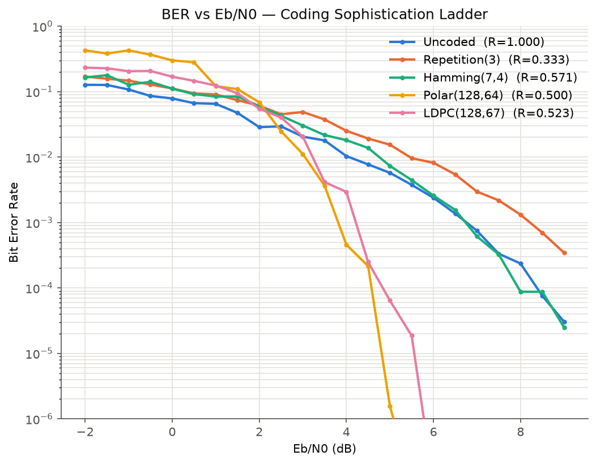
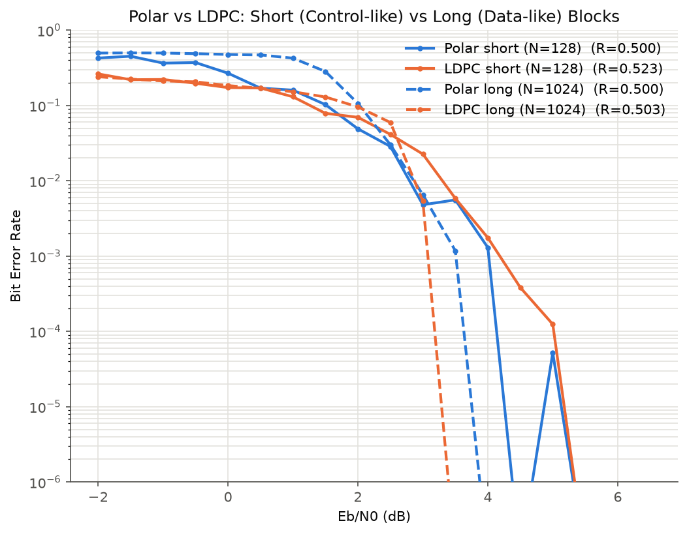

# Polar vs. LDPC Channel Coding

A from-scratch, pure NumPy/SciPy/Matplotlib comparative study of channel coding schemes, built as a "coding sophistication ladder":

**Uncoded → Repetition → Hamming(7,4) → Polar → LDPC**

5G NR uses two different code families for two different jobs: **Polar codes** for the control channel (short, critical messages — "here's how to decode what follows") and **LDPC codes** for the data channel (the bulk payload). This project implements both from first principles, plus two classical baselines, to show *why* that split exists rather than just presenting Polar and LDPC in isolation.

## Why 5G splits Polar (control) vs. LDPC (data)

Polar codes with Successive Cancellation decoding perform excellently and stay low-complexity at the very short block lengths typical of control information. LDPC's iterative decoder scales more efficiently and performs better at the large block lengths typical of user data. The [short-vs-long block experiment](#short-block-vs-long-block-the-3gpp-crossover) below reproduces exactly this crossover.

## Quick start

```bash
pip install -r requirements.txt
pip install -e .

pytest -q                                    # ~1s, 47 tests
python experiments/run_ber_sweep.py          # ~3 min, headline plot
python experiments/run_block_length_study.py # ~5 min (N=1024 codes are slower)
```

## Repo structure

```
src/channel_coding/
  harness/        BPSK modulation, AWGN channel, rate-aware Eb/N0, Monte Carlo BER loop
  codes/
    uncoded.py, repetition.py, hamming74.py    baseline codes
    polar/        Arikan kernel, Gaussian-Approximation construction, SC decoder
    ldpc/         Gallager-style H, GF(2) generator derivation, min-sum BP decoder
  utils/gf2.py    shared GF(2) linear algebra
experiments/      BER sweep + short/long block-length scripts, save to results/
tests/            pytest, one file per module
results/          committed plots (figures/) and raw sweep data (data/)
```

## Coding schemes implemented

| Scheme | Rate | Decoding | Idea |
|---|---|---|---|
| Uncoded | 1.0 | — | No redundancy; baseline. |
| Repetition(3) | 1/3 | Majority vote | Send each bit 3×, vote. Validates the AWGN/BER harness itself. |
| Hamming(7,4) | 4/7 | Syndrome lookup | 4 data bits → 7 coded bits; corrects exactly 1 error/block. |
| Polar(N,N/2) | ~1/2 | Successive Cancellation (min-sum) | Recursive channel polarization; frozen bits on unreliable synthetic channels. |
| LDPC(N,·) | ~1/2 | Min-Sum belief propagation | Sparse parity-check graph; iterative message passing. |

## Rate vs. reliability: it's not just "lowest BER wins"

A code that sends 3 coded bits per info bit (Repetition, rate 1/3) will *always* look more reliable at a fixed **coded symbol** SNR than a rate-1/2 code — it's spending 3x the energy per info bit to get there. That's a false comparison. This project's harness axis is **Eb/N0** (energy per *information* bit, in dB), not Es/N0 (energy per *coded* symbol): `eb_n0_db_to_noise_std(ebn0_db, rate)` derives the noise variance from each code's own rate, so a lower-rate code correctly sees *less* effective coded-symbol energy for the same Eb/N0. This is what makes the headline plot a fair comparison across codes of different rates — and it's also why the rate of each code is stated directly in its plot legend, not hidden. Repetition, Hamming, and Polar/LDPC each trade rate for reliability differently; a full picture needs both axes, not BER alone.

## Headline result: BER vs. Eb/N0



All five schemes swept over the same AWGN/BPSK harness, Eb/N0 from -2 to 9 dB. Escalating coding gain is visible as sophistication increases: repetition barely beats uncoded (it burns 2/3 of its rate on redundancy for a fairly weak majority-vote decoder), Hamming gives a modest, capped gain (single-error correction only), and Polar/LDPC show a steep "waterfall" — both cross below uncoded around 2-3 dB and then plunge, the classic signature of a capacity-approaching code with iterative/tree decoding.

## Short block vs. long block: what actually happens with plain SC decoding



Polar and LDPC repeated at two block-length regimes, rate held fixed at ~0.5 across all four curves so block length is the only variable: N=128 (control-channel-like, solid) and N=1024 (data-channel-like, dashed). Two things are visible: (1) both codes' waterfalls get steeper at the longer block length — expected, more bits means more averaging; (2) **LDPC's relative advantage over Polar grows with block length** — at N=128 the two are close and repeatedly cross each other, but at N=1024 LDPC's dashed curve visibly reaches the noise floor before Polar's does.

This is a real, honestly-measured result, not the full textbook 3GPP story — and the gap between them is informative. 5G NR's actual advantage for Polar at short/control-channel block lengths comes from **SC-List decoding with CRC-aided path selection**, not plain Successive Cancellation. This project implements plain SC (as the brief specifies), which is a materially weaker decoder than SC-List — enough that at N=128, plain SC-decoded Polar doesn't clearly beat LDPC's iterative BP the way 3GPP's Polar/LDPC split would suggest. Measuring that gap directly is itself the finding: it's *why* 5G's Polar decoder specifically needs the list-decoding upgrade to be competitive at short lengths, rather than plain SC being "good enough." SC-List is noted as a concrete next step in [Limitations & future work](#limitations--future-work).

## Design decisions & understanding check

**Why start with repetition and Hamming instead of jumping straight to Polar/LDPC?**
They validate the test harness with something simple enough to hand-verify (see `tests/test_repetition.py`'s explicit 1-error-corrects / 2-error-fails cases), and they set up the actual point of the project: showing *why* the field moved from simple algebraic codes to iteratively-decoded ones, not just presenting Polar/LDPC in isolation.

**Why does Hamming fail with more than one error per block?**
Its syndrome decoding is built to point at exactly one error position (a 3-bit syndrome enumerates 7 nonzero patterns matching the 7 possible single-bit-flip positions). With two errors, the syndrome is the XOR of two columns of H, which generally matches a *third*, wrong column — so decoding flips the wrong bit, actively making things worse rather than just failing to help. `tests/test_hamming.py::test_two_bit_errors_can_fail_to_decode_correctly` demonstrates this directly.

**What is channel polarization and why does it work?**
Recursively combining N copies of a channel via Arikan's 2×2 kernel causes the resulting N synthetic bit-channels' reliabilities to polarize toward two extremes — near-perfect or near-useless — a proven phenomenon (Arikan, 2009). This project ranks reliability via Gaussian Approximation density evolution (`codes/polar/construction.py`) rather than a hardcoded published table, so frozen-bit selection is derived, not looked up.

**Why does LDPC use iterative decoding instead of exact optimal decoding?**
Exact MAP decoding over the whole Tanner graph is computationally intractable at any realistic code size. Because the graph is sparse (few short cycles by construction — see the 4-cycle-avoidance retry logic in `codes/ldpc/construction.py`), local iterative message-passing (min-sum here) converges to a near-optimal answer at a fraction of the cost.

**What are frozen bits actually doing?**
They deliberately sacrifice the least reliable synthetic channels: both transmitter and receiver already agree these positions are 0, so no bits are spent describing them, and all real information sits only on channels reliable enough to decode with low error.

**The trickiest implementation detail: Polar's encoder/decoder index convention.** The generator matrix here is the raw Kronecker power `G_N = F^⊗log2(N)`, deliberately *without* the bit-reversal permutation (`B_N`) some presentations of Arikan's construction include. Bit-reversal is only needed to match a specific physical/hardware index order; it isn't needed for correctness, as long as the encoder (a direct matrix multiply) and the recursive SC decoder use the *same* contiguous-halves index convention. Getting this exactly right was the single hardest bug in the project — see the `decode.py` docstring for the "beta message" propagation detail that was the actual fix (the lower branch's message must be conditioned on the upper branch's *locally re-encoded* decision, not its raw decoded bit).

**Why Gaussian Approximation over Bhattacharyya/BEC for frozen-bit selection?**
GA models the target channel (AWGN) directly and exposes a configurable design SNR; Bhattacharyya-parameter recursion under a BEC approximation is simpler and closed-form but is a cruder model of AWGN. Both are legitimate small-project choices; GA was picked here for being self-contained (no external table) and channel-accurate.

**Why Min-Sum over full sum-product for LDPC?**
Min-sum avoids tanh/atanh evaluations that can overflow at high-confidence LLRs and is simpler to vectorize correctly; it costs some optimality relative to full belief propagation, which is the standard practical trade-off.

## Reproducing results

Both experiment scripts use a fixed master seed (`SEED = 2026`) for the Monte Carlo trials and save deterministic filenames under `results/`, so reruns overwrite in place rather than accumulating files. Raw per-SNR-point data (BER, bit error count, blocks simulated) is saved alongside each plot as CSV.

## Limitations & future work

- LDPC's H is a small, randomly-constructed regular matrix (not girth-optimized); a real system would use a structured/optimized construction (e.g. IEEE 802.11n-style or 5G NR's base-graph LDPC).
- Min-sum is used instead of full sum-product BP; a normalized/offset min-sum variant would close some of that gap cheaply.
- Successive Cancellation only — SC-List decoding (with CRC-aided path selection) is what 5G NR's Polar decoder actually uses and would meaningfully improve short-block performance.
- Regular (fixed column/row weight) LDPC only; irregular degree distributions are what make LDPC codes approach capacity in practice.
- AWGN/BPSK only — no fading, puncturing, or rate-matching, all of which real 5G channel coding must also handle.

## References

- E. Arıkan, "Channel Polarization: A Method for Constructing Capacity-Achieving Codes for Symmetric Binary-Input Memoryless Channels," 2009.
- R. Gallager, "Low-Density Parity-Check Codes," MIT Ph.D. thesis, 1962.
- P. Trifonov, "Efficient Design and Decoding of Polar Codes," 2012 (Gaussian Approximation construction).
- 3GPP TS 38.212 (5G NR channel coding).
- D. MacKay, "Information Theory, Inference, and Learning Algorithms."
- T. Richardson & R. Urbanke, "Modern Coding Theory."

## License

MIT — see [LICENSE](LICENSE).
